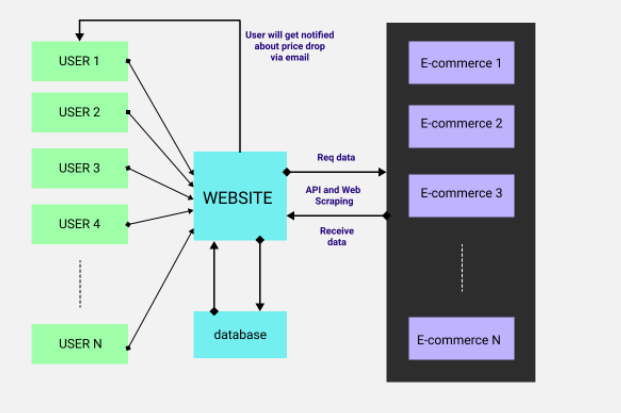

Project Requirement
===================================
To track various Products on E-commerece websites and Notify Users when Price 
goes below a Threshold value.

Project Source Code:<https://github.com/sarnobatadi/Selenium-Price-Tracker-Deployment/>

Project Timeline
===================================
=============  =========       =============
Tasks          Due Date        Task Assigned
=============  =========       =============
Design          2/9/21           Aditya
Architecture    6/10/21          Shreyash
Development     31/10/21         Onkar
Testing         31/10/21         Aditya
=============  =========       =============

Welcome to Lumache's documentation!
===================================
Lumache has its documentation hosted on Read the Docs.

**Lumache** (/lu'make/) is a Python library for cooks and food lovers
that creates recipes mixing random ingredients.
It pulls data from the `Open Food Facts database <https://world.openfoodfacts.org/>`_
and offers a *simple* and *intuitive* API.

Check out the :doc:`usage` section for further information, including
how to :ref:`installation` the project.

.. note::

   This project is under active development.

Contents
--------

.. toctree::

   usage
   api
